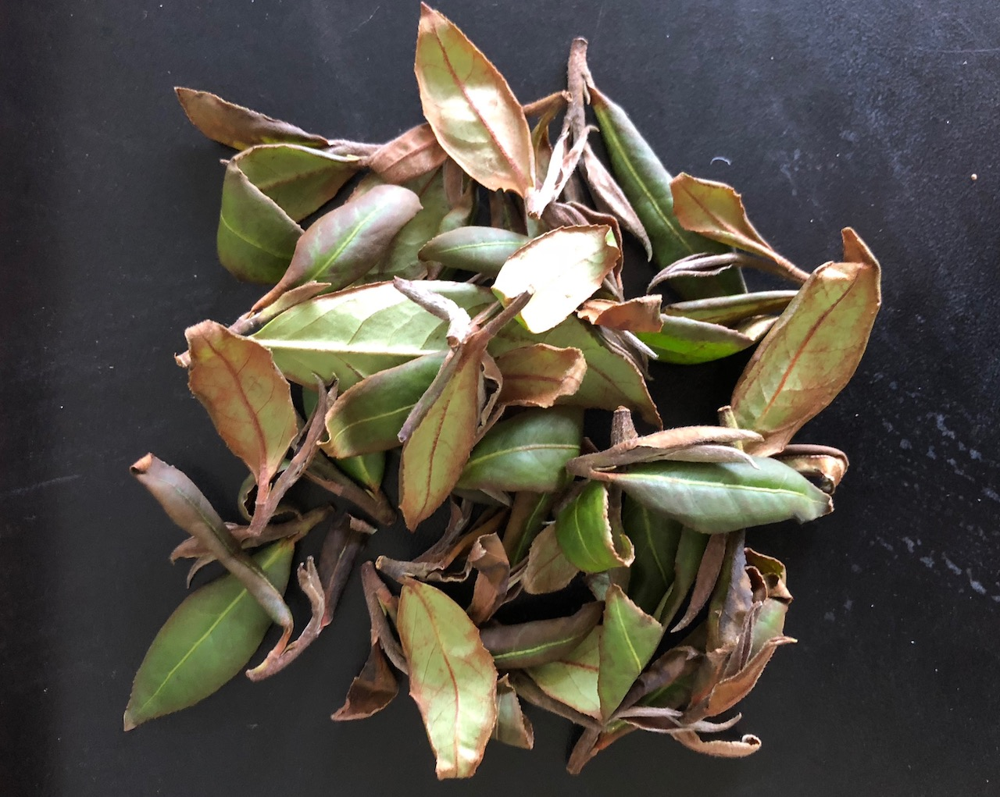
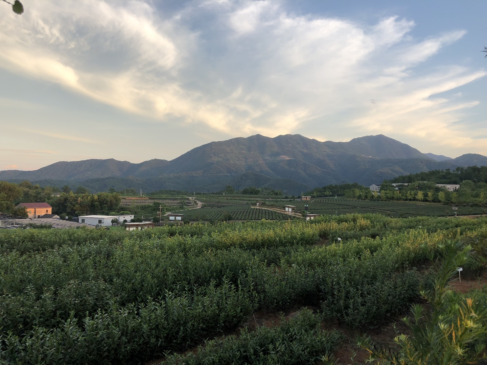
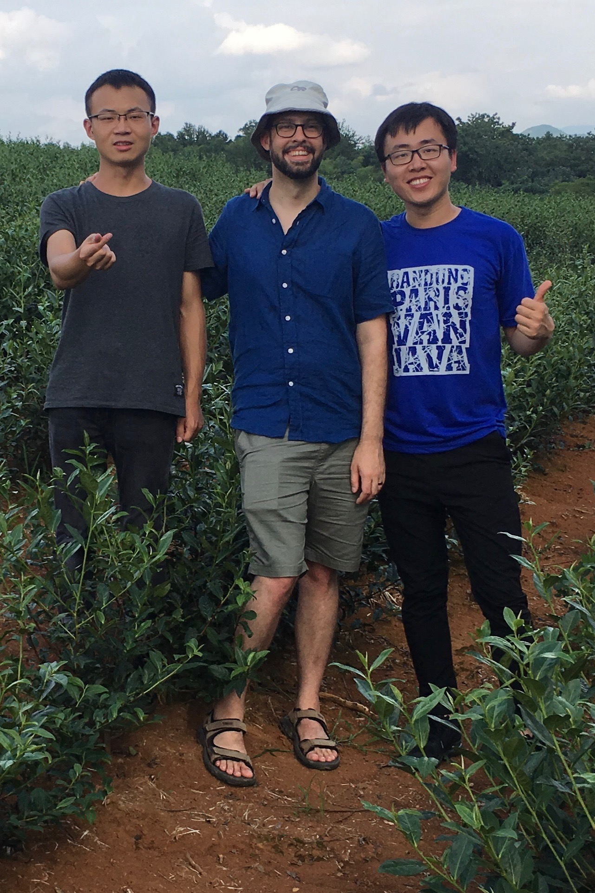
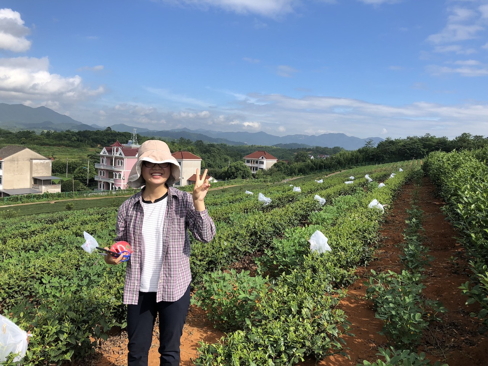

```{r include=FALSE}
library(knitr)
opts_chunk$set(echo=FALSE)
```

I'm currently in Hangzhou, China at the [Tea Research Institute](www.tricaas.com)(TRI) for my fourth and last time.
It's bitter sweet (like my favorite teas ;-) ) since I'm both glad to be nearing the end of my PhD, and sad to say goodbye to all the friends I've made and a city I've really grown to enjoy living in.

## Fieldwork

This final summer, I've been focusing on a few experiments having to do with leafhoppers and their effects on tea chemistry (see the [project page](/project/climate-leafhopper-quality/) for more info).
I'm repeating an experiment from last year, where I put different densities of insects on tea plants and measure the chemistry, but this time using two different cultivars to see if they respond differently to insect attack.

I'm also trying my hand at making oolong tea!

{fig-alt="A small pile of tea leaves that have turned brown around their edges" fig-align="center" width="598"}

This is part of an experiment aiming to better understand when leafhoppers are a pest, and when they can improve tea quality.
They're definitely considered a pest to farmers that make green tea, but prized by some farmers making [Eastern Beauty oolong](https://specialtyteaalliance.org/world-of-tea/oriental-beauty-bug-bitten-teas/).
There are *many* reasons for this, but I'm curious about how tea leaves react during processing after being previously damaged by leafhoppers.
I've written a bit about this on [TeaGeek](http://www.teageek.net/blog/2018/03/oolong-mid-oxidized/) before, so you can read more about what's going on during oolong processing there.

I'm doing these two experiments at TRI's new-ish experimental field station in near-by Shengzhou.

{fig-alt="A landscape view of tea plants planted in rows in the foreground with mountains and sky and a few buildings in the background" fig-align="center" width="656"}

It is rather boring there since there are hardly any other students working there, it's in a rural area, and it has barely functioning internet.
But the weather last week there was *amazing*.
It was dry!
It was actually dry!
In China!
I've never been anywhere **not** extremely humid in China.
In fact, it felt like home (California).
Hot, dry, cool breezes at night, scattered fluffy clouds---perfect.
I've always been lucky in that whenever I'm doing really grueling, repetitive, sweaty fieldwork, it's at least been somewhere beautiful.
That really keeps me going.

## People

I'm so happy to see old friends and meet new ones!
I've been working closely with Dr. Li Xin and his masters student, Wei Ji Peng for the past 3 years and it's great to see them again.
I've also made friends in other departments (it's easy to make friends at a tea research institute when you're a foreign tea geek!) and it's great to see them again as well.

{fig-alt="Three men standing in a tea field posing for a photo" fig-align="center" width="582"}

I've also been lucky to have a Chinese REU student working with me this summer.
Her name is Guo Ming Ming, and she's been extremely helpful in carrying out experiments, catching leafhoppers, and translating (no, even after 4 years I do not speak Mandarin well enough to do much of anything on my own).

{fig-alt="A young woman with a bucket hat standing in a tea giving a peace sign" fig-align="center" width="439"}

## Computer work

Fieldwork is fun, but its far too hot to work outside for most of the day.
So I usually finish my morning work before breakfast most days, and occasionally do some work in the evening.
Of course there are longer days for setting up experiments, but most of the time I'm in an office.
I've been working a lot on writing and coding for a paper about using partial least squares regression (PLS) on ecological data.
I'm learning a lot in the process, and I can't wait to share it with everyone (it might even include [cupcakes vs. muffins](/2018/03/05/cupcakes-vs-muffins/)!)
