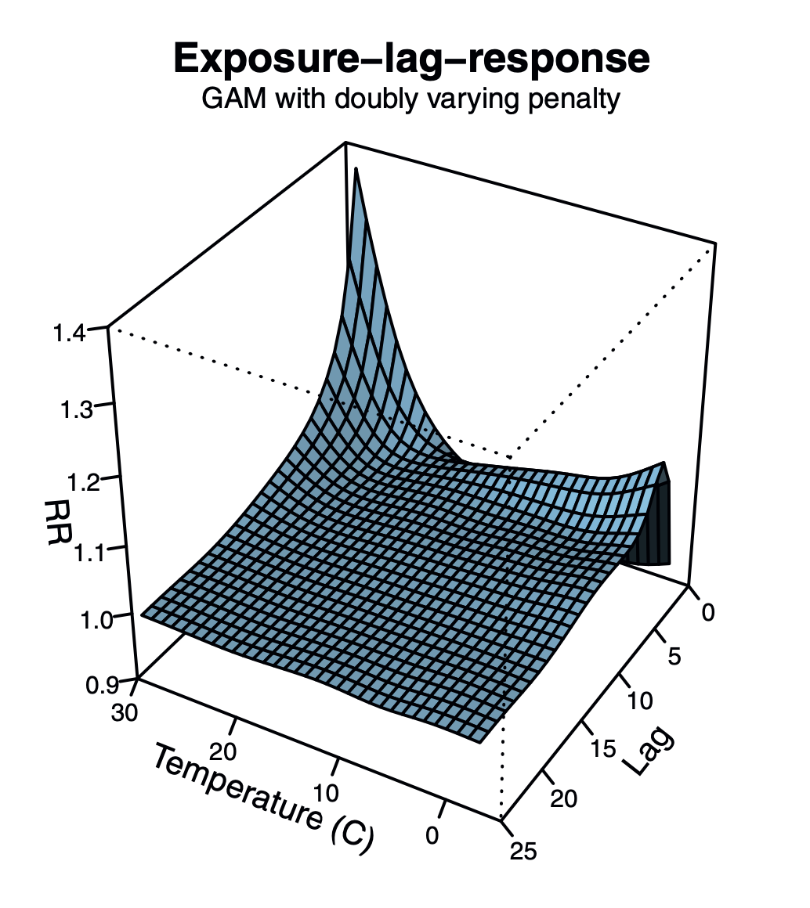

```{r setup, include=FALSE}
library(mgcv)
library(broom)
library(ggplot2)
library(patchwork)
library(MASS)

knitr::opts_chunk$set(echo = FALSE, warning = FALSE)
```

# Welcome / Disclaimer

This is the beginning of a series of blog posts where I publicly stumble my way through figuring out some confusing, complicated, and, frankly, cutting-edge modeling and statistics.
The models in question are called distributed lag non-linear models (DLNMs) and they are useful for modeling potentially delayed effects of, say, weather on some outcome like plant growth or survival.
I'm learning this stuff out loud and out in the open as a way to keep my thoughts organized so that I don't repeatedly question my decisions, so that others can learn from my mistakes, and so that maybe you, kind read, will help me understand.
So, take everything in this series with a grain of salt.
I'm not going to go back and edit posts unless I find out I wrote something really egregiously wrong.

Ok, now on to the show...

# Generalized Additive Models (GAMs)

Before we get into DLNMs, I'll describe a related and important concept---generalized additive models (GAMs).
Briefly, GAMs are a way to fit wiggly lines to data, where the wiggliness is penalized such that it tends toward a straight line unless wiggles are supported by the data.
GAMs are really useful for modeling non-linear patterns where forcing a linear (or quadratic) relationship doesn't make sense.
I'm not going to talk a whole lot about GAMs, so if you're interested in this series and GAMs are new to you, I'd recommend checking out Noam Ross's course, [GAMs in R](https://noamross.github.io/gams-in-r-course/).
It's free and really, really good.

```{r}
mcycle <- MASS::mcycle


gam_mod <- gam(accel ~ s(times), data = mcycle)
lm_mod <- lm(accel ~ times, data = mcycle)

lm_dat <- augment(lm_mod, se_fit = TRUE)
gam_dat <- augment(gam_mod)

gam_plot <- 
  ggplot(gam_dat, aes(x = times)) +
  geom_ribbon(aes(ymin = .fitted - .se.fit,
                  ymax = .fitted + .se.fit),
              alpha = 0.3) +
  geom_line(aes(y = .fitted), color = "blue") +
  geom_point(aes(y = accel), alpha = 0.5) +
  labs(title = "GAM fit", x = "x", y = "y")

lm_plot <-
  ggplot(lm_dat, aes(x = times)) +
  geom_ribbon(aes(ymin = .fitted - .se.fit,
                  ymax = .fitted + .se.fit),
              alpha = 0.3) +
  geom_line(aes(y = .fitted), color = "blue") +
  geom_point(aes(y = accel), alpha = 0.5) +
  labs(title = "Linear model fit", x = "x", y = "y")

lm_plot + gam_plot
```

# Modeling lagged effects

My journey to learning DLNMs started with a [paper](https://onlinelibrary.wiley.com/doi/abs/10.1111/2041-210X.12486) by Brittany Teller and colleagues that uses functional linear models (FLM) to model the potentially delayed effects of climate on plant growth.
A FLM is called that because at least one covariate in the model is itself a continuous function.
In this case, rather than including, for example, the temperature 1 month ago, 2 months ago, 3 months ago, etc. as separate covariates, the model includes a continuous function of temperature history as a covariate.
They did this in the context of a GAM to allow for a non-linear relationship through lag time.
See, I was looking for a method that would allow me to model delayed effects of temperature and precipitation on leafhopper densities in a tea field.
However, their method did not allow for a non-linear climate relationship (which seems likely), and, honestly, I had a hard time understanding their code.
So I went searching for something else that could model lagged effects.

I ended up finding a [paper describing DLNMs](http://doi.wiley.com/10.1111/biom.12645) by Gasparrini et al. and an R package [`dlnm`](http://www.jstatsoft.org/v43/i08/) by the same authors.
DLNMs are functional linear models with a special 2-dimensional smooth function, called a "crossbasis" function, as a covariate.
The crossbasis function fits a non-linear relationship between the response and the intensity of exposure to some environmental condition (e.g. temperature) on one dimension and a non-linear effect of lag on the other dimension.

{fig-alt="A 3D plot of a wavy blue surface.  The three axes are labeled \"RR\", \"Temperature (C)\" and \"Lag\".  It shows the highest value along the RR axis when lag is 0 and Temperature is highest at 30.  The rest of the surface is mostly flat with RR around 1."}

For example, in the figure above the relative risk of getting some disease is most strongly impacted by the temperature from 0--10 days prior to diagnosis, with increased relative risk (RR) at both low and very high temperatures (part of Figure 3 from [Gasparrini et al. 2017](http://doi.wiley.com/10.1111/biom.12645)).

The great thing about the `dlnm` package, is that it allows you to fit these crossbasis functions in the context of a GAM and take advantage of a lot of the great stuff the `mgcv` package offers.
The bad thing is that all of this is very new.
And when I say "all of this" I mean DLNMs, DLNMs fit using GAMs, and even GAMs themselves.
Heck, it was only in [2016](https://doi.org/10.1080/01621459.2016.1180986) when Simon Wood and colleagues answered the question "How to get unbiased AIC values for GAMs?".

So in this blog series I'm going to document challenges and confusions I come up against while trying to figure out how to implement and interpret these models.
Don't expect tutorials or great insights or even necessarily complete thoughts.
But please, PLEASE, chime in in the comments if you have questions or answers.


