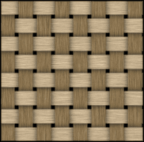

<!-- Hey, you might not bother finishing this.  You already talked about it in an earlier post on visualizing results of DLNMs -->

```{r include=FALSE, paged.print=FALSE}
library(tidyverse)
library(here)
ha <- read_rds("ha_sample.rds")
```

::: callout-note
This is part of series about distributed lag non-linear models.
Please read the [first post](/post/dlnm) for an introduction and a disclaimer.
:::

Since I've been working so much with GAMs for this project, I decided to read sections of Simon Wood's book, [Generalized additive models: an introduction with R](https://www.google.com/books/edition/Generalized_Additive_Models/HL-PDwAAQBAJ?hl=en&gbpv=0) more thoroughly.
In Chapter 5: Smoothers, there is an example **tensor product** smooth (more on what that means later) fitting a distributed lag model.
When I saw this, I started to question *everything*.
What was the `dlnm` package even doing if I could fit a DLNM with just `mgcv`?
Was it doing something *wrong*?
Was I interpreting it wrong?
Am I going to have to change EVERYTHING?

I also found [this wonderful paper](https://cdnsciencepub.com/doi/abs/10.1139/cjfr-2018-0027) by Nothdurft and Vospernik that fits a DLNM for yearly tree ring data explained by lagged, non-linear, monthly weather data.
They also used only the `mgcv` package and tensor product smooths to fit this model.
So what is a tensor product and what is the `dlnm` package doing differently?

## Tensor Products

A tensor product smooth is a two (or more) dimensional smooth such that the shape of one dimension varies smoothly over the other dimension.
Tensor products are constructed from two (or more) so-called marginal smooths.
Imagine a basket weave of wood strips.
The strips can be different widths and be more or less flexible in each dimension.
The flexibility of the strips roughly corresponds to a smoothing penalty (stiffer = smoother) and the number and width of strips roughly corresponds to number of knots.
You can bend the first strip on one dimension, but you can't really bend the adjacent strip in the completely opposite direction.
The shape of the strips in one dimension is forced to vary smoothly across the other dimension.

{fig-alt="basketweave pattern" fig-align="center"}

The tensor product for a DLNM has the environmental predictor on one dimension (SPEI, in our example) and lag time on the other dimension.
So SPEI can have a non-linear effect on plant growth, but the shape of that relationship with lag = 0 is constrained to be similar to the shape at lag = 1 (the adjacent strip of wood).
The change in the shape of the SPEI effect varies smoothly with lag time.
Here's a pure `mgcv` implementation of a DLNM.

```{r}
library(mgcv)

growth_te <-
  gam(log_size_next ~ 
        s(log_size) +
        te(spei_history, L,
          bs = "cr", 
          k = c(5, 15)),
      family = gaussian(link = "identity"),
      method = "REML",
      select = TRUE,
      data = ha)
```

## So what the heck is {dlnm} doing that's different?

After re-reading Gasparrini's papers for the billionth time and reading more of Simon Wood's book, I realized the difference between the pure `mgcv` approach and the `dlnm` approach had to do with "identifiability constraints".
Basically, because a GAM is a function that has covariates which themselves are functions, those smooth covariates are usually constrained to sum to 0.
For example, the smooth term for `s(log_size)` looks essentially centered around 0 on the y-axis when plotted.

```{r}
library(gratia)
draw(growth_te, select = 1)
```

Tensor product smooths in `mgcv` have this constraint as well, but not for each marginal function.
The entire *surface* sums to zero.

```{r}
draw(growth_te, select = 2, dist = Inf)
```

The `dlnm` package constructs a "crossbasis" function, but it does this by using **tensor products** from `mgcv`.
So what is the difference?
Well, the major difference is in how it does identifiability constraints.
For `te(..)`, the entire surface must sum to zero.
For `s(..., bs = "cb")`, the predictor-response dimension is constrained to sum to zero.
That means that every slice for any value of lag must sum to zero.
It also removes the the intercept from that dimension, so the resulting smooth ends up having fewer knots and fewer maximum degrees of freedom.

Here's the `dlnm` version:

```{r}
library(dlnm)
growth_cb <-
  gam(log_size_next ~ 
        s(log_size) +
        s(spei_history, L, #crossbasis function
          bs = "cb", 
          k = c(5, 15), 
          xt = list(bs = "cr")),
      family = gaussian(link = "identity"),
      method = "REML",
      select = TRUE,
      data = ha)
```

```{r}
draw(growth_cb, select = 2, dist = Inf)
```

Notice how it looks much more symmetrical left to right.
This is more clear if we plot all the slices through lag time on top of eachother, kind of like holding the surface up with the x-axis at eye-level and looking down the y-axis in the middle.

```{r}
eval_cb <- evaluate_smooth(growth_cb, "spei_history", dist = Inf)
eval_te <- evaluate_smooth(growth_te, "spei_history", dist = Inf)
```

```{r}
eval_cb %>% 
  #just take beginning and end
  # filter(L == min(L) | L == max(L)) %>% 
  mutate(L = as.factor(L)) %>% 
  ggplot(aes(x = spei_history, y = est, group = L)) + 
  geom_line(alpha = 0.1) +
  labs(title = "crossbasis from {dlnm}") +
  coord_cartesian(xlim = c(-0.5,0.5), ylim = c(-0.02, 0.02)) +

eval_te %>% 
  #just take beginning and end
  # filter(L == min(L) | L == max(L)) %>% 
  mutate(L = as.factor(L)) %>% 
  ggplot(aes(x = spei_history, y = est, group = L)) +
  geom_line(alpha = 0.1) +
  labs(title = "tensor product from {mgcv}") +
  coord_cartesian(xlim = c(-0.5,0.5), ylim = c(-0.02, 0.02))
```

The crossbasis function intercepts are more tightly aligned, I think because of the sum-to-zero constraint along the `spei_history` axis.

Oddly, the slices in the `dlnm` version still don't all sum to zero, so maybe I'm still not totally explaining this right.

## What does it all mean?

Ultimately, there is little difference between these approaches for these data.
If we use the `cb_margeff()` function I mentioned [earlier](post/dlnm-getting-started) on in this series to get fitted values of y (for the whole GAM, not just the smooth), then the two models look nearly identical.

```{r include=FALSE}
#' Calculate marginal effects of a crossbasis smooth
#' 
#' Calculate marginal effects of a crossbasis smooth created with the `cb` basis
#' from the `dlnm` package in a model created with `gam()`. Everything is kept
#' average (or at reference value for factors) and response values are predicted
#' using the range of values of Q at each lag defined by L.
#'
#' @param Q The matrix of predictor values used to generate a crossbasis smooth
#' @param L The matrix of lags used to generate a crossbasis smooth
#' @param model a gam with a crossbasis smooth
#' @param ref_data reference data passed to the `newdata` argument of `predict`
#'   (optional). This one-row data frame should contain values for all model
#'   terms **except** `Q` and `L`.
#' @param meshpts vector of length 2; The number of meshpoints for values of Q
#'   and L, respectively, to use to generate fitted values
#' @param calc_dist logical; Calculate distance between predicted values and
#'   actual data points?  This is inspired by the `too.far` argument of
#'   `plot.gam()`.  If `TRUE` (default), it adds the column `min_dist` which is
#'   useful for filtering data before plotting because "smooths tend to go wild
#'   away from data". This step takes a long time, so if you don't need it,
#'   consider setting to `FALSE`
#' @return a tibble suitable for plotting marginal effects as a heatmap or
#'   contour plot.  `x` is the meshpoint values across the range of the
#'   predictor, `Q`; `lag` is the values of `L`; `fitted` and `se.fit` are the
#'   results of `predict.gam()`; min_dist is the euclidean distance on the unit
#'   square from the fitted values to the actual data used to fit the model.
#' @export
#' @importFrom rlang enquo abort
#' @import purrr
#' @import dplyr
#' @import mgcv
#' @import tidyr
#' @importFrom stats predict
#'
#' @examples
#' \dontrun{
#' library(dlnm)
#' library(mgcv)
#' library(tsModel)
#' data("chicagoNMMAPS")
#' Q <- Lag(chicagoNMMAPS$temp, 0:25) #temperature data, lagged
#' L <- matrix(0:25,nrow(Q),ncol(Q),byrow=TRUE) #matrix of 0-25
#' # Fit DLNM model
#' gam1 <- gam(death ~ s(Q, L, bs="cb", k=10) + s(pm10) + dow,
#'             family=quasipoisson(), 
#'             data = chicagoNMMAPS,
#'             method='REML')
#' # Calculate marginal effect of lagged temperature, all else being held average.
#' cb_margeff(Q, L, gam1)
#' }
cb_margeff <- 
  function(model, Q, L, ref_data = NULL, meshpts = c(50, 50), calc_dist = TRUE) {
    # Q_name <- quo(Q)
    # L_name <- quo(L)
    
    if (!inherits(model, "gam")) {
      abort("This is only for GAMs made with the `mgcv` package including cross-basis smooths from the `dlnm` package.")
    } 
    
    Q_name <- rlang::enquo(Q)
    L_name <- rlang::enquo(L)
    df <- model$model
    
    # Get the Q and L matrices from the model dataframe
    Q <- dplyr::pull(df, !!Q_name)
    L <- dplyr::pull(df, !!L_name)
    
    testvals <- seq(min(Q, na.rm = TRUE), max(Q, na.rm = TRUE), length.out = meshpts[1])
    Q_new <- matrix(mean(Q, na.rm = TRUE), nrow = meshpts[1], ncol = meshpts[2])
    lvals <- seq(min(L), max(L), length.out = meshpts[2])
    L_new <- matrix(lvals, nrow = meshpts[1], ncol = meshpts[2], byrow = TRUE)
    
    # For newdata, keep everything constant except varying Q.
    # Keep numeric values constant at mean.
    # Set random effects to a new level to "trick" predict().
    # Set parametric factors to reference level.
    terms_raneff <-
      model$smooth %>% 
      purrr::map_if(~inherits(.x, "random.effect"),
                    ~pluck(.x, "term"),
                    .else = function(x) return(NULL)) %>%
      purrr::compact() %>% 
      purrr::as_vector()
    
    terms_fac <- names(model$xlevels)
    
    
    if (is.null(ref_data)) {
      #TODO newdata columns must be the same class as the model data.  I think this
      #breaks if there is a fixed-effect factor put in as a character vector.
      ref_data <-
        df %>%
        dplyr::summarize(
          across(c(-!!L_name, -!!Q_name) & where(is.numeric), mean),
          across(all_of(terms_raneff) & where(is.factor), ~factor(".newdata")),
          across(all_of(terms_fac) & where(is.factor), ~factor(levels(.x)[1], levels = levels(.x)))
        )
    }
    newdata <- uncount(ref_data, meshpts[1]) %>% add_column(!!L_name := L_new)
    resp <- array(dim = c(length(testvals), ncol(Q_new)))
    rownames(resp) <- testvals
    colnames(resp) <- lvals
    se <- resp
    #loop through columns of matrix representing different lags/distances, replace
    #with testvals, predict response.
    for (i in 1:ncol(Q_new)) {
      # is there some way I can use outer() or rbind() to just make one big matrix instead of this loop?
      P1_i <- Q_new
      P1_i[, i] <- testvals
      p <- suppressWarnings( #new levels of random effects are on purpose
        predict(
          model,
          newdata = newdata %>% add_column(!!Q_name := P1_i),
          se.fit = TRUE,
          type = "link"
        )
      )
      resp[, i] <- p$fit
      se[, i] <- p$se.fit
    }
    fitted <-
      resp %>%
      dplyr::as_tibble(rownames = "x", .name_repair = "unique") %>%
      tidyr::pivot_longer(
        cols = -x,
        names_to = "lag",
        values_to = "fitted"
      ) %>%
      dplyr::mutate(lag = as.double(lag), x = as.double(x))
    
    se.fitted <-
      se %>%
      dplyr::as_tibble(rownames = "x", .name_repair = "unique") %>%
      tidyr::pivot_longer(
        cols = -x,
        names_to = "lag",
        values_to = "se.fit"
      ) %>%
      dplyr::mutate(lag = as.double(lag), x = as.double(x))
    
    pred <- dplyr::full_join(fitted, se.fitted, by = c("x", "lag"))
    if (isTRUE(calc_dist)) {
      out <- add_min_dist(df, Q_name, L_name, pred)
    } else {
      out <- pred
    }
    return(out)
  }

#' Calculate distance between predicted values and actual data points on a grid
#' 
#' This is inspired by the `too.far` argument in `plot.gam()`.  It takes
#' predicted values and adds the distance to the model data.  You can then use
#' the `min_dist` column to filter data for plotting.
#'
#' @param df data frame; model data
#' @param Q_name quosure; the name for the Q matrix
#' @param L_name quosure; the name for the L matrix
#' @param pred data frame; the predicted values
#' @import purrr
#' 
#'
#' @return a tibble
add_min_dist <- function(df, Q_name, L_name, pred) {
  d <-
    df %>%
    pull(!!Q_name) %>% 
    as_tibble(.name_repair = ~as.character(pull(df, !!L_name)[1, ])) %>% 
    pivot_longer(everything(),
                 names_to = "lag",
                 names_transform = list(lag = as.numeric),
                 values_to = "x")
  
  grid <-
    pred %>% 
    mutate(min_g_x = min(.data$x, na.rm = TRUE),
           min_g_y = min(.data$lag, na.rm = TRUE),
           g_x = .data$x - .data$min_g_x,
           g_y = .data$lag - .data$min_g_y) %>% 
    mutate(max_g_x = max(.data$g_x, na.rm = TRUE),
           max_g_y = max(.data$g_y, na.rm = TRUE),
           g_x = .data$g_x / .data$max_g_x,
           g_y = .data$g_y / .data$max_g_y)
  
  d <-
    d %>% 
    mutate(d_x = (.data$x - first(grid$min_g_x)) / first(grid$max_g_x),
           d_y = (.data$lag - first(grid$min_g_y)) / first(grid$max_g_y))
  
  #where dat is a 2-column matrix of x and y coords of the true data used to build the model
  min_dist <- function(g_x, g_y, d) {
    d[,1] <- d[,1] - g_x
    d[,2] <- d[,2] - g_y
    min(
      sqrt(
        (d[,1]^2 + d[,2]^2)
      ), na.rm = TRUE
    )
  }
  
  #I think this is the super slow step.  Would be great if it didn't have to be rowwise().
  out <-
    grid %>% 
    rowwise() %>% 
    mutate(min_dist = min_dist(g_x, g_y, cbind(d$d_x, d$d_y))) %>% 
    select(-g_x, -g_y, -max_g_x, -max_g_y, -min_g_x, -min_g_y) %>% 
    ungroup()
  
  return(out)
}
```

```{r paged.print=FALSE}
pred_cb <- cb_margeff(growth_cb, spei_history, L)
pred_te <- cb_margeff(growth_te, spei_history, L)
```

```{r}
ggplot(pred_cb, aes(x = x, y = lag, fill = fitted)) + 
  geom_raster() +
  geom_contour(aes(z = fitted), binwidth = 0.01, color = "black", alpha = 0.3) +
  scale_fill_viridis_c(option = "plasma") +
  labs(title = "{dlnm} crossbasis") +

ggplot(pred_te, aes(x = x, y = lag, fill = fitted)) + 
  geom_raster() +
  geom_contour(aes(z = fitted), binwidth = 0.01, color = "black", alpha = 0.3) +
  scale_fill_viridis_c(option = "plasma") +
  labs(title = "{mgcv} tensor product")
```

And the summary statistics are very similar as well

```{r}
anova(growth_cb)
anova(growth_te)
```

The major difference, you'll notice, is that the reference degrees of freedom are larger for the tensor product version.
Again, that is because the crossbasis function constrains the SPEI dimension to sum to zero and the intercept along that dimension is removed.

## Why {dlnm}?

So the advantages of the `dlnm` package for fitting DLNMs are probably mostly evident when you consider cases besides GAMs.
For example, If I wanted to constrain the lag dimension to be a switchpoint function, or if I wanted the SPEI dimension to be strictly a quadratic function, I could do that with `dlnm`.
If you're interested in interpreting your results in terms of relative risk ratios, then `dlnm` offers some OK visualiztion options for that.
When using smooth functions for both marginal bases, the differences between using a straight tensor product with `te()` and using a crossbasis function start to fade away.
The `dlnm` version is still a little easier to interpret, I think, because you can more easily compare slices through lag time with the plot of the smooth itself.
